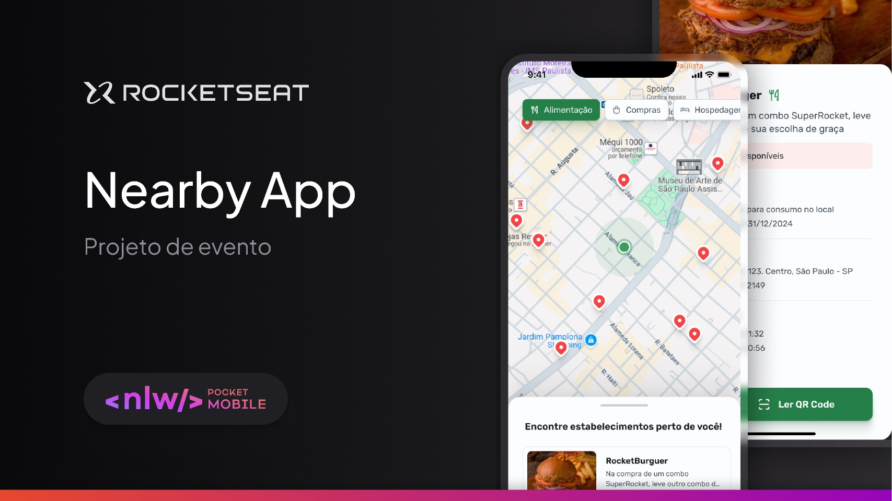

# ✨ **Aplicação Mobile com React Native e Expo**

**Status do Projeto**: ✔️ Finalizado  
**Última atualização:** 13/12/2024  

## **Índice**
- [Visão Geral](#visão-geral)  
- [Funcionalidades](#funcionalidades)  
- [Tecnologias Utilizadas](#tecnologias-utilizadas)  
- [Como Visualizar o Projeto](#como-visualizar-o-projeto)  
- [Sobre a Rocketseat](#sobre-a-rocketseat)  

---

## **Visão Geral**

Este projeto é um aplicativo desenvolvido em **React Native** utilizando **Expo**, com foco em exibir informações dinâmicas e interativas, como listas de categorias, locais e validação de cupons. A aplicação foi criada para demonstrar práticas modernas de desenvolvimento mobile.  

  

---

## **Funcionalidades**
- **Tela de Dicas**: Interface inicial com informações e recomendações.  
- **Navegação**: Fluxo entre diferentes telas utilizando React Navigation.  
- **Tela Home**:  
  - Exibição de categorias e locais dinâmicos obtidos de uma API.  
  - Integração com um mapa interativo que exibe marcadores.  
- **Tela de Detalhes do Local**: Informações específicas sobre cada local.  
- **Validação de Cupons**: Leitura e validação prática diretamente no app.  

---

## **Tecnologias Utilizadas**
- **React Native**: Framework para desenvolvimento mobile.  
- **Expo**: Ferramenta que simplifica o desenvolvimento e testes.  
- **React Navigation**: Navegação entre telas.  
- **API**: Integração para buscar dados dinâmicos.  
- **Mapas**: Exibição de mapa interativo com marcadores.  

---

## **Como Visualizar o Projeto**

### **Passos**
1. Clone o repositório:  
   ```bash
   git clone https://github.com/pkcosta843/mobile.git
   ```
2. Acesse o diretório do projeto:  
   ```bash
   cd mobile
   ```
3. Instale as dependências:  
   ```bash
   npm install
   ```
4. Inicie o servidor do Expo:  
   ```bash
   npm start
   ```

---

## **Sobre a Rocketseat**

A **Rocketseat** é uma plataforma de ensino que ajuda desenvolvedores a evoluírem suas habilidades com ferramentas modernas como **React Native**, **Node.js** e **Expo**. Se você deseja aprender desenvolvimento mobile de forma prática e acelerada, confira os conteúdos da Rocketseat!  

---

## **Licença**

Este projeto é de uso livre para aprendizado. Modifique e implemente conforme suas necessidades!  

---
Feito com ❤️ e **React Native**.
